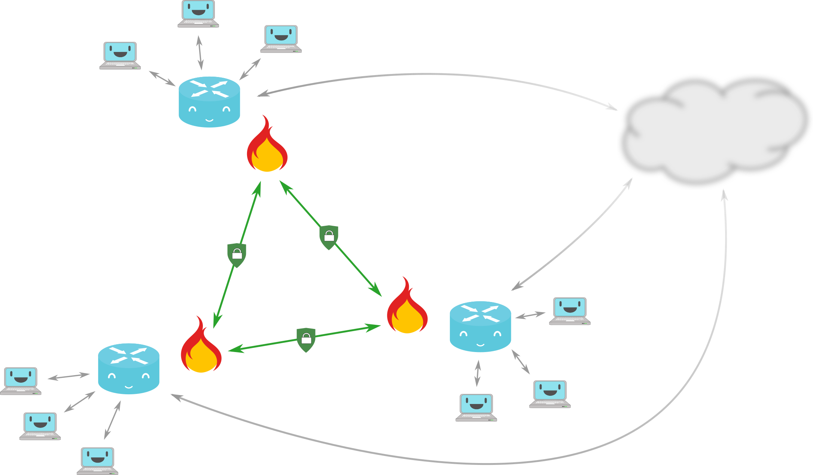

#   

🚧 🚧 🚧 🚧

…is a *virtual private network* (VPN) gateway you can use to interconnect your
LANs. Vita acts as a tunnel between your local, private network and any number
of remote Vita gateways. With it, nodes spread across your outposts can
communicate with each other as if they were on the same LAN, with
confidentiality and authenticity ensured at the network layer. Vita is probably
more efficient at encapsulating traffic than your application servers. You can
free cycles for your application by offloading your packet encryption and
authentication workload to Vita.

A Vita network can be as small as two nodes with a single route, and as large
as you like. For each pair of Vita gateways, a separate secure tunnel (*route*)
can be established—“can be” because a Vita network does not need to be a full
mesh, instead arbitrary hierarchies are supported on a route-by-route basis.
Each route uses a pre-shared super key that is installed on both ends of the
route. These keys need to be configured only once, and only need renewal when
compromised, in which case the breach will affect only the route in question.
The actual keys used to encrypt the traffic are ephemeral, and negotiated by
Vita automatically, with no manual intervention required.

Deploying Vita is easy, and not invasive to your existing infrastructure. It
can be as simple as adding an entry to the IP routing table of your default
gateway, to ensure that packets to destinations within your private network are
routed over an extra hop: the Vita gateway. Whether Vita forwards the
encapsulated packets back to your default gateway, or directly to your modem
depends on your setup, and is freely configurable.

To configure a Vita route, you need to specify the address prefix of the
destination subnetwork, and the public IP address of the target Vita gateway
(in addition to the pre-shared key). At the other end, you specify the source
prefix and gateway address in symmetry. You can even add and remove routes
while Vita is running, without affecting unrelated routes.

## WARNING:

> Vita is in its early “tech-demo” stage of development. Not for production!

## Features

- Runs on commodity hardware
- Implements IPsec for IPv4, specifically
  *IP Encapsulating Security Payload* (ESP) in tunnel mode
- Uses optimized AES-GCM 128-bit encryption based on a reference
  implementation by *Intel* for their AVX2 (generation-4) processors
- Suitable for 1-Gigabit, 10-Gigabit (and beyond?) Ethernet
- Automated key exchange and rotation (work in progress!)
- Dynamic reconfiguration (update routes while running)
- Strong observability: access relevant statistics of a running Vita node

## Documentation

- [Usage](https://github.com/inters/vita/blob/master/src/program/vita/README)
  — manual page for Vita’s command line interface
- [Configuration](https://github.com/inters/vita/blob/master/src/program/vita/README.config)
  — detailed description of Vita’s configuration language

## Getting started

Vita runs on any modern Linux/x86-64 distribution, but requires a compatible
network interface card (currently *Intel* chipsets i210, i350, and 82599).

    $ git clone https://github.com/inters/vita
    $ cd vita
    $ RECIPE=Makefile.vita make -j
    $ sudo src/vita --help

The `vita` binary is stand-alone, includes all auxiliary applications, and can
be copied between machines.

For example, to install Vita and the Snabb monitoring tool on the local
machine:

    $ sudo cp src/vita /usr/local/bin/vita
    $ sudo ln -s vita /usr/local/bin/snabb-top

## Powered by

[Snabb](https://github.com/snabbco/snabb) is a simple and fast packet
networking toolkit with a wonderful community.
